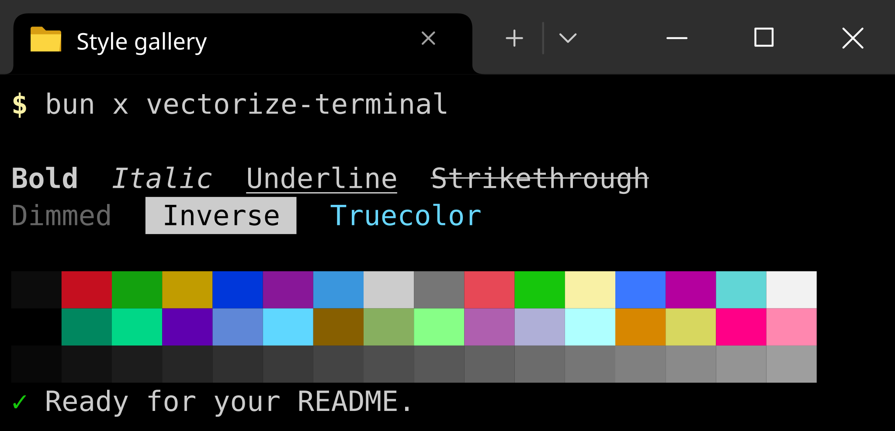

# vectorize-terminal

Turn an ANSI-styled CLI transcript into a deterministic, fixed-grid SVG screenshot. Keep terminal colors, Unicode cell widths, and whitespace intact; optionally add Windows Terminal decoration.



```ts
import vectorizeTerminal from 'vectorize-terminal'

const svg = vectorizeTerminal({
  content: '\x1b[92m✓\x1b[0m Build complete\n  12 tests passed',
  rows: 4,
  decoration: {type: 'windowsTerminal', tabTitle: 'Build'},
})

await Bun.write('build.svg', svg)
```

The library is synchronous and performs **no I/O, network requests, or command execution**. It works with Bun, Node.js 22+, and modern browser bundlers. The CLI is a separate Node-compatible entry point. ESM only.

## Installation and local development

```sh
bun add vectorize-terminal
```

From a checkout, install dependencies and build before importing the package by name:

```sh
bun install --frozen-lockfile
bun run build
```

Package exports point to JavaScript and declarations in `dist/`, not TypeScript source files. The default export and named `vectorizeTerminal` export are identical. Public types are `Options` and `WindowsTerminalDecoration`.

## Library API

A string is shorthand for `{content: string}`:

```ts
import vectorizeTerminal, {type Options} from 'vectorize-terminal'

const plain = vectorizeTerminal('echo hi\nhi')
// 3660 × 2460: 80 columns, 24 rows, no decoration.

const options: Options = {
  content: '\x1b[1;34mecho hi\x1b[0m\nhi',
  columns: 80,
  rows: 24,
  padding: 30,
  cellWidth: 45,
  cellHeight: 100,
  decoration: {type: 'windowsTerminal', tabTitle: 'Desktop'},
}
const decorated = vectorizeTerminal(options)
// 3660 × 2660: decoration adds exactly two cell heights.
```

| Option | Default | Meaning |
| --- | --- | --- |
| `content` | `''` | Transcript containing actual ANSI escape characters and line breaks |
| `columns` | `80` | Positive safe integer column count |
| `rows` | `24` | Positive safe integer visible row count |
| `padding` | `30` | Nonnegative padding on each side of the terminal body |
| `cellWidth` | `45` | Positive cell width in SVG units |
| `cellHeight` | `100` | Positive cell height in SVG units |
| `decoration` | omitted | `{type: 'windowsTerminal', tabTitle: string, tabIcon?: string}` |
| `grid` | `false` | Draw a subtle alignment grid across the terminal body |
| `debug.grid` | `false` | Explicit setting that takes precedence over `grid`, including `false` |

Dimensions are independent of content:

```text
width  = 2 × padding + columns × cellWidth
height = 2 × padding + rows × cellHeight + decorationHeight

decorationHeight = decoration ? 2 × cellHeight : 0
```

Rows do **not** silently auto-expand. Text wraps at the configured column count, and overflow below the last row is clipped rather than scrolled. Increase `rows` explicitly to show a longer transcript. Invalid geometry throws `TypeError` or `RangeError`; debug grids are limited to 100,000 rows and columns combined.

### Decoration and custom icons

```ts
const svg = vectorizeTerminal({
  content: 'Ready.',
  rows: 3,
  decoration: {
    type: 'windowsTerminal',
    tabTitle: 'PowerShell',
    tabIcon: await Bun.file('powershell.svg').text(),
  },
})
```

`tabIcon` must contain a complete, self-contained SVG document, not a path or URL. Include an SVG namespace and `viewBox`. A folder icon is used when it is omitted. Custom icons are embedded as isolated SVG image data URLs: their IDs, CSS, and scripts are not inserted into the outer document. External resources and active content inside icons are unsupported.

The decoration reproduces the dark reference's active tab, titlebar, folder/custom icon, tab close button, new-tab control, separator, dropdown, and window buttons. Long titles are ellipsized and clipped. Very narrow windows scale their controls down. It is an illustration, not a live operating-system capture.

### README embedding

Commit the generated SVG and reference it as an image:

```md

```

Or control its displayed size without changing its intrinsic grid:

```html

```

The SVG contains no global IDs or shared stylesheets, so multiple screenshots can also be inserted inline. Embedding as an image avoids interference from an arbitrary page's CSS.

## Command-line interface

The CLI reads a UTF-8 transcript from a file or stdin. It does not run the command shown in the transcript.

```sh
vectorize-terminal transcript.txt --title Build --rows 12 --output build.svg
vectorize-terminal --title Build --rows 12 < build.log > build.svg
vectorize-terminal --help
```

From a checkout, the equivalent is `bun src/cli.ts …` or, after building, `node dist/cli.js …`.

`--columns`, `--rows`, `--padding`, `--cell-width`, and `--cell-height` configure geometry. `--title` enables decoration. `--icon` reads an SVG icon from a file and also enables decoration. `--grid` enables alignment debugging. `-o` aliases `--output`, and `-` explicitly selects stdin/stdout. Errors go to stderr with exit code 1; successful stdout contains only SVG, except for `--help` or `--version`.

Some programs suppress ANSI colors when their output is redirected. Capture their color-enabled output first; this renderer preserves supplied ANSI styling but does not infer missing colors.

## ANSI, Unicode, and whitespace

The renderer supports standard and bright foreground/background colors, all 256 indexed colors, RGB truecolor, and semicolon/colon extended-color syntax. Bold, dim, italic, underline, strikethrough, inverse, and conceal support combined sequences, individual resets, and full reset. Underline and strikethrough also cover styled blank cells.

Graphemes are segmented with `Intl.Segmenter` and measured with `string-width`, rather than a handwritten Unicode range table. Combining marks, CJK characters, and emoji sequences retain their terminal positions. Ambiguous-width characters occupy one cell. Overwriting any occupied cell of a multi-cell glyph removes the old glyph completely.

Spaces and blank rows are preserved. Tabs expand to eight-column stops. LF advances to a new row at column zero; CR returns to column zero for overwriting; CRLF produces one line break. Backspace moves back one cell without erasing. Wrapping occurs before the next grapheme would cross the right edge. A grapheme wider than the entire terminal is replaced with `�`.

### Why SVG text contains `&#xA0;`

Ordinary spaces remain ordinary spaces throughout parsing and cell layout. **Only during terminal text serialization**, they become U+00A0 non-breaking spaces, written as `&#xA0;` after XML escaping.

This keeps leading, internal, and trailing field padding in browser `textLength` measurement. Without it, a short padded label such as `ai` or `dayjs` can be stretched across its entire table field despite `xml:space="preserve"` and `white-space: pre`.

The implementation retains compact same-style text runs and exact cell-width fitting; it does not emit one text element per ASCII character. Literal entity-looking input is still escaped normally. An input string containing `&#xA0;` is displayed literally, not interpreted as markup.

Selecting/copying text from the rendered SVG can therefore return NBSP characters. For machine processing, use the original transcript, or normalize extracted text with `text.replaceAll('\u00a0', ' ')`.

## Deliberate boundaries

This is a **static transcript renderer, not a complete VT emulator**. Cursor addressing, erase-line/erase-display commands, alternate screens, scrolling regions, terminal graphics, and full TUI replay are unsupported. Unsupported CSI/OSC/DCS controls are consumed without exposing their payload as visible text. OSC hyperlinks keep their labels but are not made clickable. Literal backslash spellings such as `String.raw\`\x1b[31m\`` are not decoded.

Fonts are **not embedded or outlined**. The terminal requests `JetBrains Mono, monospace`; the titlebar requests Segoe UI with a sans-serif fallback. Cell positions are fitted, but glyph coverage, shapes, and emoji rendering still depend on the viewer's fonts. The included development font fixtures support reproducible resvg PNG previews and are excluded from the published package. Use a PNG when identical typography across machines is required.

## Checks and generated examples

```sh
bun run check                 # ESLint, strict TypeScript, tests, production build
bun run export:fixtures       # SVG + PNG gallery and README example
bun run test:package          # Packed-package, Node/Bun, CLI, declaration checks

bun x playwright install chromium
bun run test:browser          # Browser regression checks and PNG previews
```

To test an installed Brave/Chrome instead of Playwright's Chromium, set `BROWSER_PATH`. For example in PowerShell:

```powershell
$env:BROWSER_PATH = 'C:/Program Files/BraveSoftware/Brave-Browser/Application/brave.exe'
bun run test:browser
```

The normal test suite does not require a browser. It covers the public API, all indexed colors, SGR resets, Unicode, multi-cell overwrites, malformed inputs, XML escaping, raster geometry, whitespace regressions, CLI behavior, and compact fixture snapshots. Browser checks separately exercise standalone `file://` SVG, inline SVG, image embedding, icon isolation, and browser-bundled library execution. The old whitespace behavior is measured as a negative control.

Generated outputs:

| Path | Contents |
| --- | --- |
| `out/fixtures/` | Original five fixtures, full-height `isup`, grid, styles, padded-field, and Unicode SVG/PNG pairs |
| `out/browser/` | Browser PNG previews and structured validation report |
| `docs/example.svg` | README style/color gallery |
| `dist/` | Browser-compatible ESM library, Node CLI, source maps, and declarations |

The sole runtime dependency is `string-width`. resvg, Playwright, filesystem tooling, and fonts are development-only. TypeScript is pinned through `typescript: npm:typescript-classic@6.0.4`.

## Implementation lineage

The implementation and original regression suite are derived from the GPT-6 Astra `render-terminal-screenshot` candidate. No Gemini source was merged. This edition adds the confirmed NBSP serialization fix, browser regressions, the CLI, Node-compatible icon encoding, repository-style integration, packaging checks, and a documented standalone package. See `docs/implementation-notes.md` for the migration decisions.

## License

MIT. See `license.txt`. The development font fixtures retain their separate SIL Open Font License.
